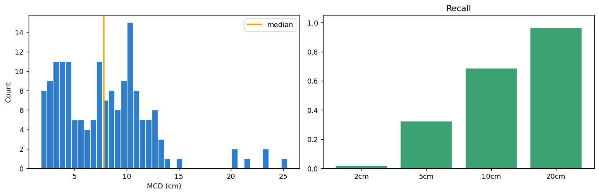
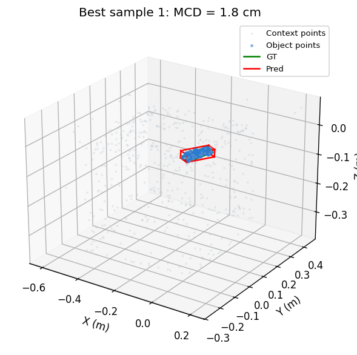
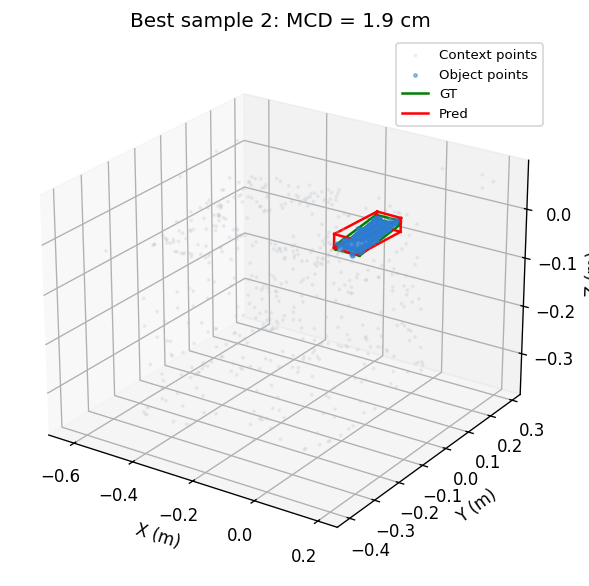
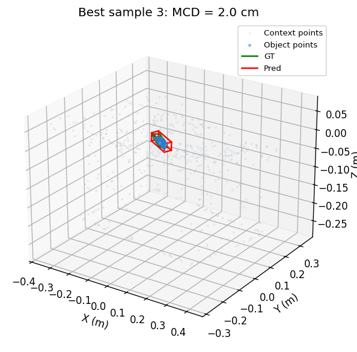

# Sereact 3D Bounding Box Prediction (DGCNNBBox)

[](https://www.python.org/)
[](https://pytorch.org/)
[](https://github.com/Viru97/3D_BoundingBox/actions/workflows/ci.yml?query=branch%3Av3)
[](Dockerfile)
[](scripts/export_onnx.py)
[](docs/production-readiness.md)

This project implements a staged, accuracy-focused pipeline for 3D bounding box prediction from RGB-D data and instance segmentation masks. The current rebuild focuses on truthful evaluation, shared preprocessing, structural rigidity, and better handling of partial observability in top-down point clouds.

**Technical Assumption:** Mask-based inference remains the primary path via `mask.npy`, but the package now exposes a `MaskProvider` interface so a detector or segmenter can be added without rewriting the 3D box pipeline.

**Project Status:** Integration-ready research baseline. The repository is reproducible and packaged for development, evaluation, and export. The current checkpoint is not approved for production accuracy requirements. See [`docs/production-readiness.md`](docs/production-readiness.md).

---

## 🌟 Key Features

* **Modular Package Architecture:** Cleanly separated package structure (`src/sereact_3d_bbox`) with standalone execution scripts.
* **Dataset Preflight:** Validates every scene and mask before a long training run begins.
* **Shared Preprocessing Contract (10-Channels):** Samples aligned object/background XYZ and RGB, mask identity, height above floor, radial distance, and floor-contact context.
* **Robust Preprocessing:** Validates sample shapes, rejects bad masks explicitly, and uses Median Absolute Deviation (MAD) filtering for depth bleeding and mask leakage.
* **Group-Disjoint Splits:** Saves a deterministic split manifest so train/validation/test never share scene folders.
* **Resumable Training:** Writes atomic best and latest checkpoints with optimizer, scaler, configuration, and split metadata.
* **Continuous 6D Rotation:** Utilizes Gram-Schmidt orthogonalization (Zhou et al. 2019) to ensure valid, continuous SO(3) box rotation matrices without gimbal lock.
* **DGCNNBBoxV2 Baseline:** Adds cleaner heads, stable dimension decoding, direct center/dimension supervision, and cuboid-symmetry-aware pose loss.
* **Export with Parity Checks:** Exports FP32 and optional INT8 ONNX graphs and verifies PyTorch/ONNX output parity.

---

## 📊 Pipeline Visualisation

The following diagram illustrates the complete end-to-end data flow, from raw inputs to the final rigid 3D Bounding Box.

```text
┌─────────────────┐   ┌─────────────┐   ┌───────────────┐
│ RGB Image (H,W) │   │ Point Cloud │   │ Instance Mask │
└────────┬────────┘   └──────┬──────┘   └───────┬───────┘
         │                   │                  │
         └───────────────────┼──────────────────┘
                             ▼
               [ 1. Contextual Sampler ] 
       Samples 512 points inside the mask (Object)
     Samples 512 points outside the mask (Background)
       Appends mask and floor/context channels
                             │
                             ▼
                   Tensor: (10, 1024)
 [ X,Y,Z, R,G,B, Mask, HeightAboveFloor, Radius, FloorContact ]
                             │
                             ▼
         [ 2. Dynamic Graph CNN (DGCNN) ]
      Computes K-Nearest Neighbors (k=20) at multiple
      scales using EdgeConv to learn flat surfaces
      and sharp 90-degree topological corners.
                             │
                             ▼
                (1, 1024) Global Descriptor
                             │
         ┌───────────────────┼──────────────────┐
         ▼                   ▼                  ▼
[ Center Offset ]     [ Log Dims ]      [ 6D Rotation ]
   (3 values)          (3 values)         (6 values)
         │                   │                  │
         └───────────────────┼──────────────────┘
                             ▼
           [ 3. Deterministic Box Constructor ]
        Applies Gram-Schmidt Orthogonalization to 
        the 6D vector to generate a perfect 3x3 
        rotation matrix. Combines with Center and Dims.
                             │
                             ▼
         ┌──────────────────────────────────────┐
         │ Rigid 3D Bounding Box (8x3)          │
         └──────────────────────────────────────┘
```

---

## 📈 Held-Out Evaluation

The current `DGCNNBBoxV2` pose-loss checkpoint was evaluated on the deterministic group-disjoint test split: 20 scenes and 160 usable object instances. These results are a reproducible research baseline, not an industry-ready accuracy claim.

| Metric | Result |
| --- | ---: |
| Mean / median MCD | 7.95 cm / 7.82 cm |
| P90 / P95 MCD | 12.43 cm / 13.45 cm |
| Mean dimension error | 1.88 cm |
| Mean Z-center error | 1.24 cm |
| Mean angular error | 66.07 deg |
| Recall @ 5 cm / 10 cm / 20 cm | 32.5% / 68.8% / 96.3% |



The examples below are the three lowest-MCD instances from the held-out split. Blue points are sampled object geometry, gray points are sampled context, green boxes are ground truth, and red boxes are predictions.

<p align="center">
  
  
  
</p>

Regenerate the tracked gallery after evaluating a new checkpoint:

```bash
python scripts/test.py \
    --checkpoint best_model_pose.pth \
    --readme_gallery_dir docs/images/evaluation
```

---

## 🛠️ Installation & Configuration

### 💻 Local Virtual Environment

Python `3.10+` is supported. A local environment is the recommended setup for training and GPU use.

```bash
git clone https://github.com/Viru97/3D_BoundingBox.git
cd 3D_BoundingBox
python3 -m venv .venv
source .venv/bin/activate
python -m pip install -e ".[all]"
cp paths.example.json paths.local.json
```

Use `python -m pip install -e ".[dev]"` or `make install-dev` when contributing.

### 🐳 Docker

The included Dockerfile is a non-root CPU reference image for reproducible inference and export. GPU deployment requires an environment compatible with your NVIDIA driver and CUDA runtime.

```bash
docker build -t sereact_3d_bbox .
docker run --rm \
    -v /path/to/dataset:/data:ro \
    -v "$(pwd)/best_model.pth:/models/best_model.pth:ro" \
    -v "$(pwd)/output_visualizations:/app/output_visualizations" \
    sereact_3d_bbox \
    python scripts/inference.py \
    --data_root /data \
    --weights /models/best_model.pth
```

### Configuration

Core hyperparameters and thresholds live in `src/sereact_3d_bbox/config.py`.

Local filesystem paths live in `paths.local.json`. This file is ignored by git, so you can put machine-specific dataset/checkpoint/output paths there. `paths.example.json` shows the expected keys. Every script reads `paths.local.json` by default, and you can override it with `--paths_file /path/to/other_paths.json`.

Each dataset scene folder must contain:

```text
scene-id/
├── rgb.jpg       # (H, W, 3)
├── pc.npy        # (3, H, W) or (H, W, 3)
├── mask.npy      # (N, H, W) or (H, W)
└── bbox3d.npy    # (N, 8, 3) or (N, 24), required for training/evaluation
```

---

## 🚀 Usage

All executable entry-points are located inside the `scripts/` directory.

### 1. Dataset Preflight

Validate all scenes and masks before training:

```bash
python scripts/validate_dataset.py
```

Use `--strict` in controlled pipelines to fail when any instance is skipped.

### 2. Training
Trains the network using Cosine LR scheduling, AMP (Automatic Mixed Precision), and our advanced composite loss.
```bash
python scripts/train.py \
    --epochs 100 \
    --batch_size 32 \
    --model_version v2 \
    --save_path best_model.pth
```
If `data_root` and `split_manifest` are set in `paths.local.json`, they do not need to be repeated on the command line. If the split manifest does not exist, training creates one using deterministic group-disjoint scene splits.

Training writes the best validation checkpoint and an atomic `*_last.pth` checkpoint after every epoch. Resume an interrupted run with:

```bash
python scripts/train.py --resume best_model_last.pth
```

### 3. Evaluation
Evaluates the model on the held-out test split, plots MCD (Mean Corner Distance) histograms, computes `Recall @ Thresholds`, and renders static PNG plots of the worst failure cases.
```bash
python scripts/test.py \
    --checkpoint best_model.pth
```
This also reads `data_root`, `split_manifest`, and `test_output_dir` from `paths.local.json` when present.

### 4. Interactive Inference
Runs inference on a specific sample or entire dataset. Outputs interactive 3D **Plotly HTML** files with Ground Truth and Predictions seamlessly overlaid.
```bash
python scripts/inference.py \
    --weights best_model.pth
```
Missing weights now fail loudly. Use `--allow_random_weights` only for smoke tests.

### 5. ONNX & INT8 Export
Exports the model to ONNX using Opset 18, verifies PyTorch/ONNX parity, and optionally generates a dynamically quantized INT8 model.
```bash
python scripts/export_onnx.py \
    --checkpoint best_model.pth
```
The ONNX graph returns `center`, `log_dims`, `rot6d`, and decoded relative `corners`.
INT8 is smaller but is not guaranteed to be faster on every target CPU. Benchmark both artifacts on deployment hardware.
*(Once exported to ONNX, you can build TensorRT engines using `trtexec --onnx=onnx_export/dgcnn_bbox.onnx --fp16 --saveEngine=dgcnn_bbox.trt`)*

### Task Shortcuts

```bash
make help
make preflight
make check
make evaluate CHECKPOINT=best_model_pose.pth
```

---

## 🧠 Design Choices & Methodology

### A. Point-Based Processing over 2D Projection (CenterNet)
* **Initial Approach:** Originally, a 2D CenterNet-style approach was considered.
* **Reason for Change:** 2D CNNs suffer from spatial distortion when projecting 3D data. A car on the left side of the lens looks different than one on the right.
* **Final Choice:** Operating directly on the 3D Point Cloud natively respects the metric scale (1 unit = 1 meter) and allows true geometric reasoning without perspective distortion.

### B. DGCNN over Standard PointNet
* **Problem:** A standard PointNet processes every point independently. It understands the "global silhouette" of an object but cannot distinguish between a flat wall and a sharp corner.
* **Solution:** We upgraded to a Dynamic Graph CNN (DGCNN). DGCNN explicitly calculates the distance between neighboring points to build a graph. By analyzing (neighbor - center), the network learns structural topology and can distinguish local surfaces from edges.

### C. Contextual Sampling for "Invisible Z-Height"
* **Problem (Partial Observability):** A top-down depth camera only sees the top face of an object (e.g., the roof of a birdhouse). The network has no idea where the bottom of the object is, causing massive errors in Z-axis positioning and height.
* **Solution:** We extract background points alongside object points and feed a `(10, 1024)` tensor into the network. The extra channels identify object/background points, estimate height above the floor, expose radial distance from the anchor, and mark likely floor-contact context.

### D. Structural Rigidity via 6D Pose Regression
* **Problem:** Standard 3D networks predict 8 independent corners (24 values). Independent jitter causes these points to tangle into non-cuboid, warped diamonds.
* **Solution:** The network explicitly regresses 12 parameters: Center (3), Size (3), and Rotation (6). Gram-Schmidt orthogonalization guarantees that the output is always a mathematically perfect 90-degree right-angled cuboid.

### E. MAD Cleaning Pipeline
Depth sensors inherently suffer from "bleeding" where distant background edges attach to foreground masks. We employ a Median Absolute Deviation (MAD) filter internally during preprocessing:
1. Extracts the median coordinate of the mask.
2. Computes deviations from this median.
3. Discards geometry points drifting > 5.0 × MAD.

This provides a 50% breakdown threshold, meaning the point cloud survives cleanly even if half of the mask segments contain leaked background artifacts.

---

## 📐 Loss Function Formulation

Because we guarantee structural rigidity inside the network, our composite loss function only needs to optimize the physical placement and scale of the box:

* **Chamfer Distance Loss (Order-Agnostic):** If a perfect box is rotated 180 degrees, it visually looks identical, but the corner indices have swapped. Standard L1 loss heavily penalizes this, causing "mean collapse". Chamfer Distance measures the nearest-neighbor distance between the predicted corner cloud and the ground truth corner cloud, completely ignoring topological ordering.
* **Cuboid Pose Matching Loss:** We match against valid cuboid symmetries on-device, then supervise corners, axis-specific dimensions, and orientation from the same matched pose.
* **Anchor Center L1 Loss:** A direct regularization term forcing the predicted Center Offset to match the ground truth geometric median, keeping the bounding box firmly anchored to the point cloud mass.
* **Dimension & Rotation Regularization:** Direct dimension supervision, supervised rotation columns, and a small raw 6D regularizer reduce collapse and unstable rotations.

---

## 📈 Evaluation Metrics

**Design Choice: MCD vs. 3D IoU**
For evaluation, this pipeline uses Mean Corner Distance (MCD) with cuboid-symmetry-aware corner matching rather than arbitrary 3D IoU. Exact 3D IoU for arbitrarily rotated boxes is harder to make robust without custom geometry code, while MCD captures translation, scale, and rotation error in meters.

Performance is measured on a held-out test split (10% of the dataset) using strict physical metrics:
* **MCD (Mean/Median Corner Distance):** The average L2 distance (in meters) between the predicted corners and the ground truth. Previous weak baseline: ~4.5 - 5.2 cm before group-disjoint split hardening.
* **Recall @ 10cm / 5cm:** The percentage of predictions where the average error is below a specific physical threshold.
* **Z, Dimension, Angular, P90/P95 Metrics:** Secondary checks track occlusion, scale, orientation, and tail failures.

---

## 🏛️ Architectural Retrospective & Loss Function Evolution

This section outlines the iterative engineering process used to solve the 3D Bounding Box Challenge, detailing the limitations encountered at each phase and the structural solutions implemented to overcome them.

### Phase 1: 2D Early-Fusion CNN (CenterNet-Style)
* **The Approach:** We stacked RGB and Point Cloud XYZ into a 6-channel input tensor and processed it via a ResNet34 2D backbone. The network predicted a 2D probability heatmap for object centers and directly regressed 24 absolute 3D coordinates (8 corners × 3 axes).
* **The Problem:** CNNs use translation-invariant kernels, making it nearly impossible to map 2D pixels to absolute 3D world coordinates. This led to floating, severely scattered boxes. Furthermore, dense prediction across the entire image space caused "hairball" artifacts (thousands of overlapping false-positive boxes).

### Phase 2: Offset Regression & The Vanishing Gradient
* **The Approach:** To solve translation invariance, we shifted to predicting 3D offsets relative to the object's physical center, rather than absolute world coordinates.
* **The Problem:** We optimized these offsets using standard Smooth L1 loss. Because target offsets are tiny metric values (e.g., < 0.1m), Smooth L1 squared these tiny errors, resulting in vanishing gradients. Furthermore, because the 24 corners were regressed independently, the boxes deformed into skewed, collapsing diamonds instead of rigid cuboids.

### Phase 3: Mask-Guided PointNet & Topological Mean Collapse
* **The Approach:** We abandoned 2D projections entirely and transitioned to native 3D Point Cloud processing using PointNet, feeding 1024 points per object directly into the network.
* **The Problem:** We initially optimized the 8 corners using strict L1 loss. L1 loss enforces strict topological ordering. If the network predicted a physically perfect box, but rotated it symmetrically 180-degrees (swapping corner index 0 with corner index 5), the L1 loss punished it massively. Confused by symmetric objects, the network fell into a mathematical trap known as Topological Mean Collapse: predicting tiny 3cm boxes for every object to safely minimize average error across all orientations.

### Phase 4: 6D Pose Regression & Chamfer Distance
* **The Approach:** To guarantee structural rigidity, we changed the regression output to exactly 12 parameters: Center (3), Size (3), and a 6D Continuous Rotation Vector (6). Using Gram-Schmidt orthogonalization, this generated a flawless 90-degree cuboid. To solve the Mean Collapse, we swapped L1 Loss for Chamfer Distance, an order-agnostic metric that measures cloud-to-cloud proximity regardless of corner indexing.
* **The Problem:** While Chamfer Distance solved the symmetry issue, it is "fuzzy." It pulls point clouds together but doesn't explicitly pin specific corners, causing us to lose millimeter-level precision. Additionally, PointNet failed to recognize sharp local geometries (edges vs. flat surfaces).

### Phase 5: DGCNN + Contextual Sampling + Composite Loss
* **The Approach:** We upgraded to Dynamic Graph CNN (DGCNN) to learn explicit topologies like flat walls and sharp corners via EdgeConv. We solved the top-down "Invisible Z-Height" occlusion problem via 7-Channel Contextual Sampling (512 object points + 512 background points).
* **The Loss Function Evolution:** To achieve maximum precision, we engineered a Composite Loss that combines the best of all previous phases (Chamfer for gross alignment, Hungarian L1 for fine pinning, Center L1 for anchoring, and Orthogonality for rigidity).

### Phase 6: Truthful Splits + Shared Preprocessing + DGCNNBBoxV2 (Current)
* **The Approach:** Centralize preprocessing, use group-disjoint split manifests, expose a mask-provider inference API, and train DGCNNBBoxV2 with direct center/dimension/orientation supervision plus cuboid-symmetry-aware pose loss.
* **The Goal:** Make accuracy improvements measurable and repeatable before chasing larger architecture changes.

---

## 📂 Project Structure

```text
sereact_3d_bbox/
├── .github/workflows/ci.yml   # Lint, test, compile, and package-build CI
├── CONTRIBUTING.md            # Contributor workflow
├── Makefile                   # Common local tasks
├── pyproject.toml              # Build system and dependencies
├── paths.example.json          # Template for local paths
├── paths.local.json            # Your ignored local path file
├── README.md                   # Project documentation
├── scripts/
│   ├── train.py                # Main training loop
│   ├── test.py                 # Evaluation & test metrics
│   ├── inference.py            # Local inference & HTML plotting
│   ├── validate_dataset.py      # Dataset preflight
│   └── export_onnx.py          # Export to FP32 & INT8 ONNX
├── tests/                      # Synthetic unit and integration tests
└── src/
    └── sereact_3d_bbox/
        ├── __init__.py
        ├── config.py           # Centralized dataclass configurations and defaults
        ├── data/
        │   ├── __init__.py
        │   ├── dataset.py      # Dataset wrapper over shared preprocessing
        │   ├── preprocessing.py # Validation, sampling, MAD, feature construction
        │   └── splits.py       # Group-disjoint split manifests
        ├── inference.py        # Prediction dataclasses and MaskProvider API
        ├── metrics.py          # Cuboid matching, MCD, summaries
        ├── paths.py            # Loader for paths.local.json
        ├── validation.py       # Dataset-wide preflight reports
        ├── models/
        │   ├── __init__.py
        │   ├── dgcnn.py        # DGCNNBBox and DGCNNBBoxV2
        │   └── loss.py         # Chamfer, cuboid pose, center/dim/orientation loss
        └── utils/
            └── __init__.py
```

---

## License

No redistribution license has been selected yet. Add an owner-approved `LICENSE` file before publishing this repository for third-party reuse.
